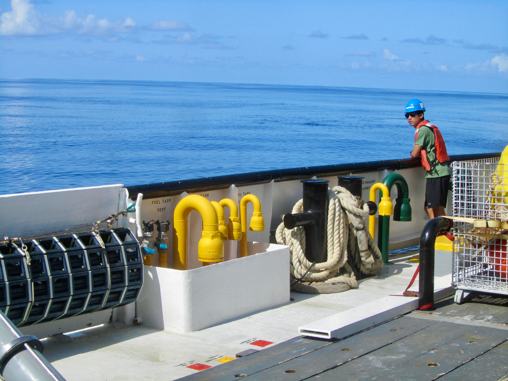

# BIOS-SCOPE - Integrated Science in the Sargasso Sea


Since 2015, [Dr. Craig Carlson](https://bios.asu.edu/about/team-members/craig-carlson) has led the [BIOS-SCOPE program](https://bios.asu.edu/scope/about), bringing together an international team of researchers spanning microbial evolution, cell biology, biochemistry, marine chemistry, and geochemistry. The program is based at the Arizona State University's Bermuda Institute of Ocean Sciences and leverages the exceptional infrastructure and long-term observational record available in the Sargasso Sea.

BIOS-SCOPE focuses on the seasonally oligotrophic northwestern Sargasso Sea, a region shaped by deep winter mixing and strong summer stratification. By building on the nearly four-decade legacy of [The Bermuda Atlantic Time-series Study (BATS)](https://bios.asu.edu/bats), the program seeks to advance understanding of elemental cycling and biogeochemical processes in low-productivity ocean gyres that dominate much of the global ocean.

Through tightly coordinated field observations and experiments, BIOS-SCOPE investigates the sources, transformations, and fate of dissolved and particulate organic matter across the upper ocean and into the mesopelagic and bathypelagic zones. Integrated molecular approaches, including metagenomics and proteomics, are used to link organic matter cycling to the structure and activity of microbial, fungal, zooplankton, and phytoplankton communities at this well-studied but highly dynamic site.

```{r, echo=FALSE, fig.cap= "In 2013, my first research cruise through BIOS, during the summer course Microbial Oceanography: The Biogeochemistry, Ecology, and Genomics of Oceanic Microbial Ecosystems, sparked my path into oceanography. I’m grateful to return to BIOS and contribute to its leadership in ocean science and education.", out.width = '90%', fig.align='center'}

```

Within BIOS-SCOPE, my research focuses on quantifying how dissolved organic matter (DOM) is processed by marine microbes using a combination of classic remineralization assays and continuous-flow marine bioreactors. I also lead efforts to collect high-resolution underway bio-optical and physiological measurements, providing context for discrete sampling, supporting satellite ocean color validation, and advancing mechanistic understanding of bio-optical relationships in oligotrophic systems.


## Outreach and Media

- [ASU BIOS Radio Spot on Ocean 89 | World Ocean Day](https://www.youtube.com/watch?v=bVcBA423noM)
- [HSBC ASU BIOS Presentation](https://bernews.com/2026/06/photos-hsbc-hosts-asu-bios-presentation/)