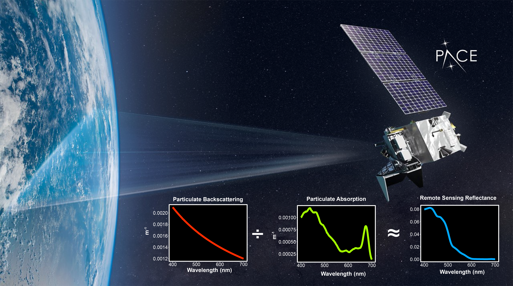

# Diel phytoplankton bio-optical properties

```{r, echo=FALSE, fig.cap= "Remote sensing reflectance (rrs) represents light detected by ocean color satellites, including the NASA Plankton, Cloud, Aerosol, and ocean Ecosystem (PACE) mission. Because rrs is impacted by the absorption and scattering of light by phytoplankton, it can be sensitive to variability in phytoplankton bio-optical properties that occur across species and over the day night cycle.", out.width = '90%', fig.align='center'}

```

How do marine phytoplankton change from day to night, and why does it matter for satellite ocean color observations? Satellites rely on daylight snapshots of ocean color to estimate phytoplankton productivity and carbon cycling, but these organisms are not static over a 24-hour period.

In our recent NASA-funded study, tracked diel (day–night) changes in the bio-optical properties of three ecologically important phytoplankton species under controlled laboratory conditions. We found that their optical signals varied by as much as 3-fold over a single day. These shifts were linked to changes in cell morphology, composition, and photophysiology, and importantly, the timing and magnitude of these changes differed by species. This work marks the first culture-based characterization of full diel cycles in particulate backscattering, offering a new lens for refining ocean color algorithms

Our findings show that both time of day and community composition significantly influence the optical signals retrieved by satellites. These factors must be accounted for to improve estimates of ocean productivity, ecosystem health, and climate feedbacks.

<p class="project-text">
    You can read the full study <a href="https://doi.org/10.1002/lno.12493" target="_blank" rel="noopener noreferrer">here</a>.
  </p>


 <!-- Video section -->
<div style="flex: 0 0 250px; min-width: 200px;">
  <video autoplay muted loop playsinline controls style="width: 100%; max-height: 500px; object-fit: contain; border-radius: 8px; background-color: black;">
  <source src="movies/o2cfloats.mov" type="video/mp4">
  Your browser does not support the video tag.
</video>

  <p style="font-size: 14px;  color: #6d6e71; margin-top: 10px;">
  A short reel from a 38 day research cruise in the South Pacific focused on diel sampling where we made bio-optical measurements and collected samples to develop a new method for examining the macromolecular composition (i.e, lipids, proteins, carbohydrates) of phytoplankton cells.
  </p>
</div>