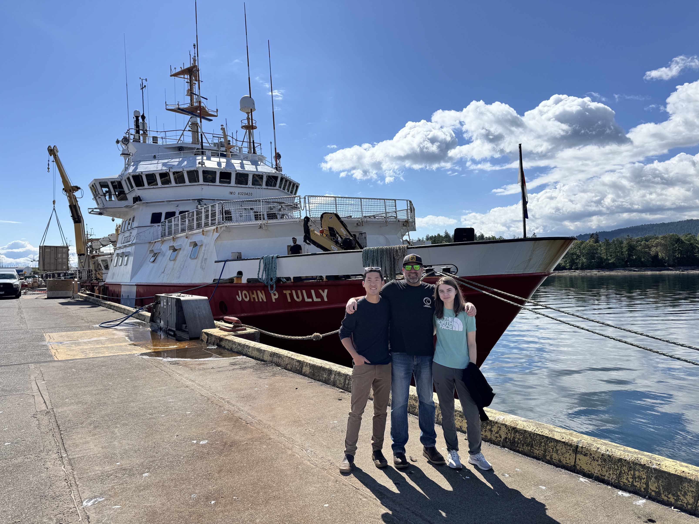

# PACE Validation Science Team - Particles and Biological Rates

In February 2024, NASA launched the [Plankton, Aerosol, Cloud, ocean Ecosystem (PACE)](https://pace.oceansciences.org/about.htm) satellite to improve how we observe our changing oceans from space. With it came the Ocean Color Instrument (OCI), a state-of-the-art sensor that captures subtle shifts in ocean color. These changes can reveal important shifts in phytoplankton, microscopic organisms that form the base of the marine food web.

Changes in phytoplankton biomass or community composition can ripple through entire ecosystems and even influence Earth’s climate. With its high-resolution, hyperspectral imaging capabilities, PACE offers a new opportunity to potentially detect early signs of ecological change, such as harmful algal blooms (HABs), with greater accuracy than ever before.

At Oregon State University, Dr. Jason Graff leads our group as part of NASA’s [PACE Validation Science Team](https://pace.oceansciences.org/pvstdoi.htm) and we are one of 24 groups selected to support the mission. Our job is to help ensure that what PACE sees from space matches real-world conditions in the ocean.

```{r, echo=FALSE, fig.cap= "In May 2025, we made measurements on the Canadian Coast Guard Ship John P. Tully in collaboration with scientists from the Line P and La Perouse long-term sampling programs, covering both coastal-shelf and open ocean ecosystems.", out.width = '90%', fig.align='center'}

```

We are collecting high-quality measurements from research vessels during satellite overpasses to serve as “ground truth” for validating key satellite products, including:

- Phytoplankton carbon biomass
- Total particulate organic carbon (POC)
- Net primary production (how much carbon phytoplankton fix through photosynthesis)
- Bio-optical properties such as how particles absorb, scatter, or reflect light in the water

By comparing these ship-based observations with satellite data, we’re helping fine-tune and verify the algorithms behind PACE’s ocean products. This work increases confidence in using remote sensing to monitor the health of our oceans. Read more about our PVST work off the coast of Urugauy from Dr. Graff's NASA [Notes from the Field](https://science.nasa.gov/blogs/notes-from-the-field/2026/04/27/off-uruguay-pace-partners-connect-data-from-satellite-and-sea/). 
